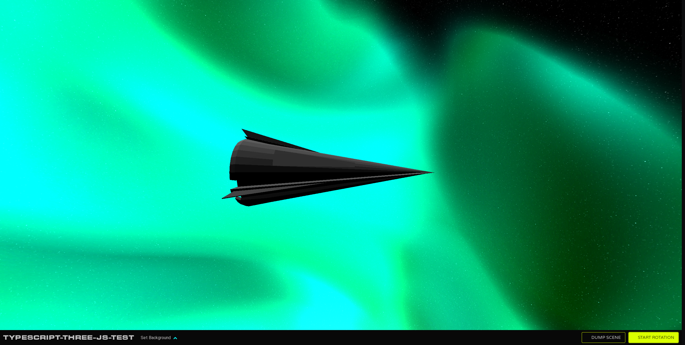

# Typescript ThreeJS Test

_typescript-three-js-test_ combines Typescript, Three.js, and Bulma into crude game environment.



## Components

 - [Three.js](https://threejs.org/), primary 3D engine.
 - [Typescript](https://www.typescriptlang.org/), primary programming language.

## Setup

Install [Node.js](https://nodejs.org/en/download/).
Run the following commands:

``` bash
# Install dependencies (only for first time)
npm install

# Serve at localhost:8080
npm run dev

# Build for production in the dist/ directory
npm run build
```
